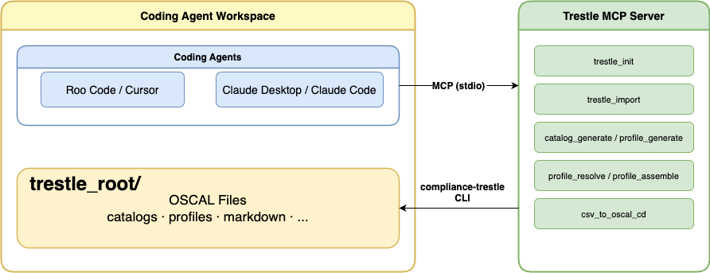
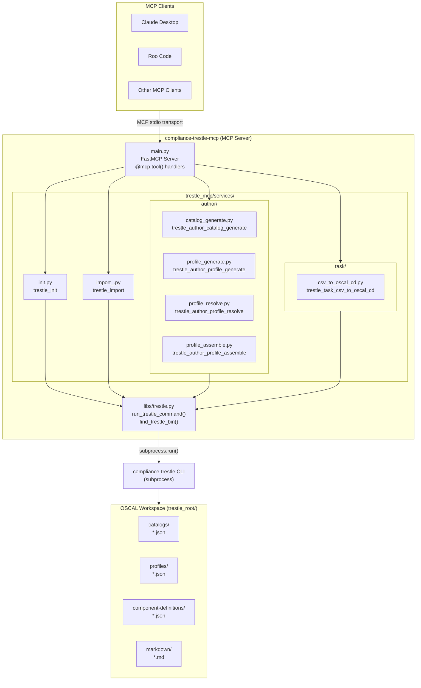
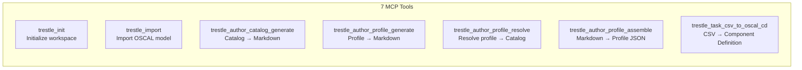
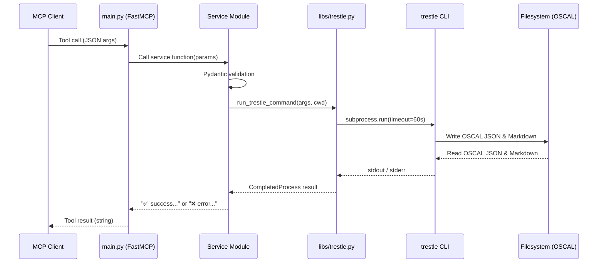
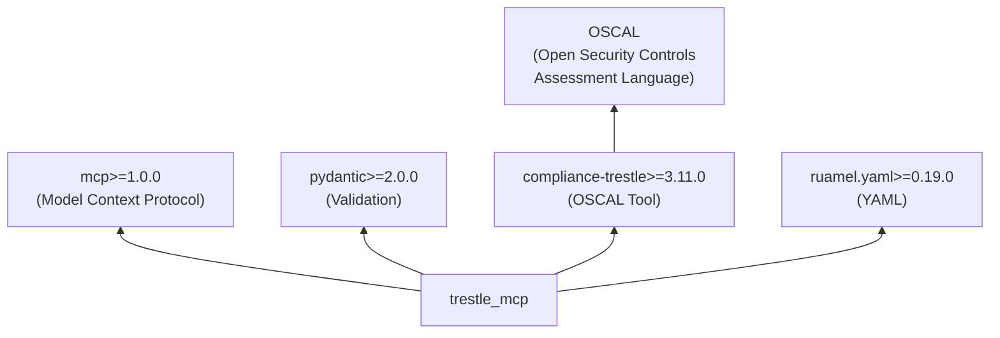

# Architecture

## High-Level Overview

**compliance-trestle-mcp** is an [MCP (Model Context Protocol)](https://modelcontextprotocol.io/) server that bridges AI coding agents with [compliance-trestle](https://github.com/oscal-compass/compliance-trestle), an OSCAL-based compliance automation tool.

The coding agent workspace doubles as the `trestle_root` — the directory that compliance-trestle uses to store and manage OSCAL artifacts. This means the AI agent can read and edit OSCAL files (catalogs, profiles, component definitions, markdown control docs) directly alongside the MCP tools that operate on them.

**Request flow:**
1. The user asks the coding agent (Roo Code, Claude, etc.) to perform an OSCAL operation in natural language.
2. The coding agent calls the appropriate MCP tool exposed by the Trestle MCP Server.
3. The server translates the call into a `compliance-trestle` CLI command and runs it as a subprocess.
4. The CLI reads from and writes to the `trestle_root/` directory inside the workspace.

## System Overview

The server is structured around a thin service layer. Each MCP tool has a dedicated service module under `trestle_mcp/services/` that validates inputs via Pydantic and constructs the appropriate CLI arguments. All subprocess execution is centralized in `libs/trestle.py`, which locates the `trestle` binary and runs it with a 60-second timeout.

## MCP Tools

| Tool | Description |
|------|-------------|
| `trestle_init` | Initializes a new trestle workspace, creating the directory structure for OSCAL artifacts. |
| `trestle_import` | Imports an OSCAL model (catalog, profile, component definition, etc.) from a URL or local file. |
| `trestle_author_catalog_generate` | Generates editable Markdown from an OSCAL catalog JSON. |
| `trestle_author_profile_generate` | Generates editable Markdown from an OSCAL profile, scoped to the controls it selects. |
| `trestle_author_profile_resolve` | Resolves a profile against its source catalog(s) and outputs a resolved catalog with parameter values substituted. |
| `trestle_author_profile_assemble` | Assembles a directory of edited Markdown control files back into a Profile JSON. |
| `trestle_task_csv_to_oscal_cd` | Converts a CSV file containing control implementation data into an OSCAL Component Definition JSON. |

## Data Flow

Tool handlers are all `async def` to support concurrent MCP calls. Errors are returned as formatted strings (never raised as exceptions) so the MCP client always receives a readable result. Some tools (e.g. `csv_to_oscal_cd`, `profile_assemble`) generate temporary config files required by the underlying CLI command and clean them up after execution.

## Dependency Stack

`compliance-trestle-mcp` is intentionally a thin wrapper — it adds no OSCAL logic of its own. All compliance semantics live in `compliance-trestle`, keeping this package focused solely on exposing that functionality over the MCP protocol.
